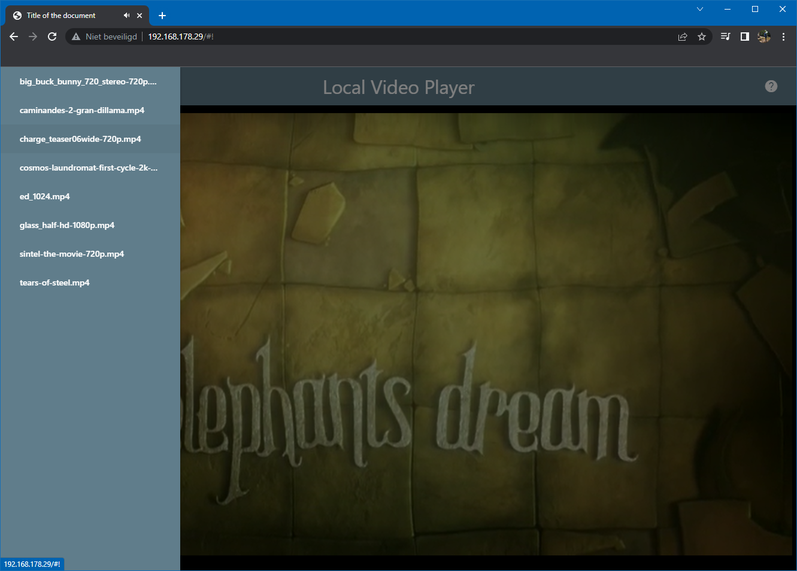

### StreamHub: A Secure Online Video Streaming Web Application

## Project Description:
StreamHub is a robust online video streaming platform built using C++, HTML, CSS, JavaScript, and htdocs. This web application enables users to stream video content securely over HTTPS, ensuring privacy and data protection. StreamHub offers a seamless and responsive interface for browsing, uploading, and streaming videos, with real-time transcoding and playback optimization for various devices. By combining server-side C++ for performance-critical tasks and a front-end developed using modern web technologies, StreamHub provides a highly scalable and secure streaming experience.

### Features

- **Secure HTTPS streaming**: Ensures encrypted and secure video streaming.
- **Responsive UI**: Built with HTML, CSS, and JavaScript to provide a fluid user experience across devices.
- **Real-time video transcoding**: Server-side C++ handles performance-intensive video processing.
- **Upload & Stream**: Users can upload their videos to be processed and streamed.
- **Fast streaming**: Optimized playback speed and quality for various network conditions.
- **Cross-browser support**: Compatible with modern browsers.

## Tech Stack

- **Front-end**: HTML, CSS, JavaScript
- **Back-end**: C++ (for processing and transcoding)
- **Server**: htdocs directory (Apache Server)
- **Security**: HTTPS encryption for secure streaming
- **Deployment**: Local or cloud-based deployment on Apache server using htdocs.

### Installation Guide

## 1. Clone the repository
git clone https://github.com/LikhithaKornu/LikhithaKornu-HCL-VIDEO-STREAMING
cd streamhub
## 2. Set up Apache Server (htdocs)
- **Install and configure Apache Server**.
- **Move the project files to the htdocs folder (e.g., C:/xampp/htdocs/streamhub)**.
- **Enable HTTPS on your Apache server**.
- **Generate an SSL certificate using OpenSSL or another method**.
- **Modify the Apache httpd.conf file as follows**:
Listen 443
<VirtualHost *:443>
    DocumentRoot "C:/xampp/htdocs/streamhub"
    SSLEngine on
    SSLCertificateFile "path_to_cert.pem"
    SSLCertificateKeyFile "path_to_key.pem"
</VirtualHost>
## 3. Back-End Setup (C++)
- **Ensure a C++ compiler (e.g., GCC) is installed**.
- **Navigate to the backend/ folder and compile the C++ server code**:
g++ server.cpp -o server
./server
## 4. Front-End Setup (HTML, CSS, JS)
- **Navigate to the frontend/ folder to modify the HTML, CSS, and JavaScript files if needed**.
- **Make sure the front-end files are linked correctly to the back-end for streaming**.
- **The homepage will be accessible at https://localhost/streamhub once the Apache server is running**.
## 5. Testing
- **Launch the web application by visiting https://localhost/streamhub in your browser**.
- **You can now upload and stream videos securely over HTTPS**.
## Usage
- **Home Page: Browse available videos or upload your own**.
- **Upload Video: Upload a video file, which will be processed by the C++ back-end**.
  - **Stream Video: Select a video to stream; the application will handle transcoding and optimize playback for your device**.
### Security
- **HTTPS Encryption: Supports secure streaming with SSL certificates**.
- **Input Validation: Validates all inputs to prevent attacks**.
- **Cross-Site Scripting (XSS) Prevention: Sanitizes user input to secure the front-end**.
## Contact
- **For any queries, contact the project maintainer at likhithakornu03@gmail.com**.
### Streaming Video over HTTP

